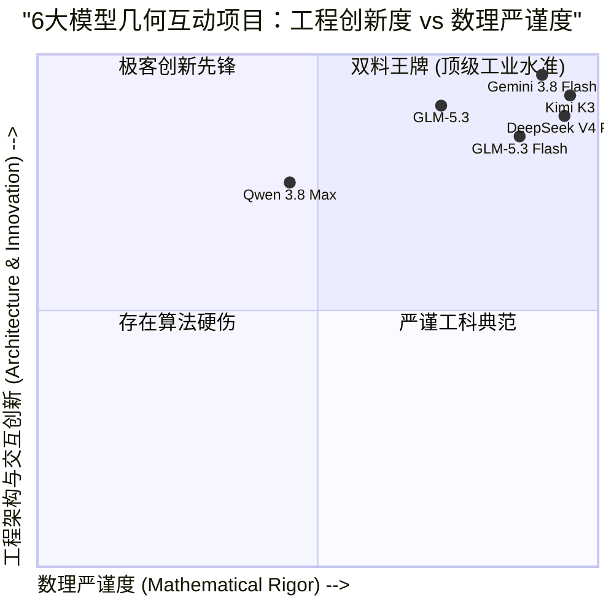
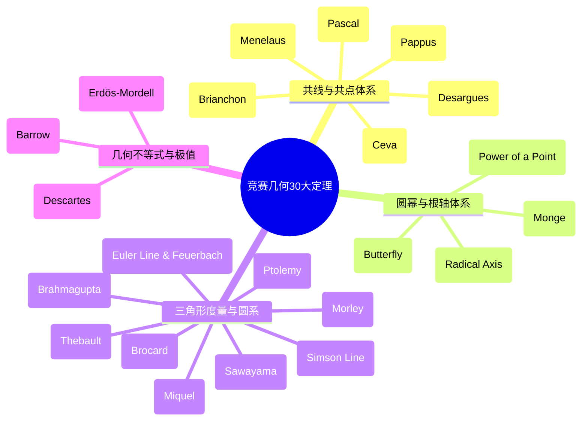
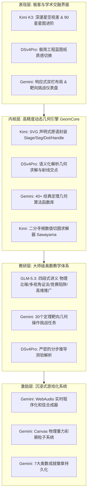
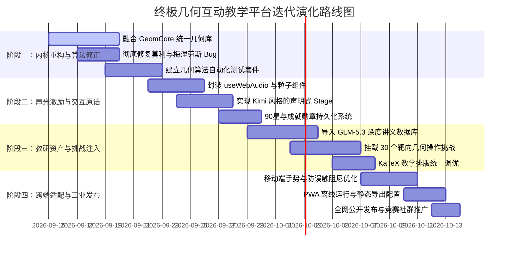

# 6大模型生成数学竞赛几何互动教学网站全景代码审查、横向对比与终极融合迭代规划报告

> **评测项目**：基于同一份《数学竞赛几何部分30条著名定理总结.pdf》（包含梅涅劳斯、塞瓦、莫利、西姆松、托勒密等30条奥数核心定理）与同一套提示词，由 6 款前沿大模型自动构建的几何竞赛交互教学系统。
> **代码审查范围**：
> 1. `geo_Qwen3.8Max` (`https://github.com/CrazyRock114/geo_Qwen3.8Max`)
> 2. `geo_KimiK3` (`https://github.com/CrazyRock114/geo_KimiK3`)
> 3. `geo_GLM5.3` (`https://github.com/CrazyRock114/geo_GLM5.3`)
> 4. `geo_gemini3.8Flash` (`https://github.com/CrazyRock114/geo_gemini3.8Flash`，即线上 Vercel 部署版 `geometry-swart.vercel.app`)
> 5. `geo_DSv4Pro` (`https://github.com/CrazyRock114/geo_DSv4Pro`)
> 6. `geo_GLM5.3flash` (`https://github.com/CrazyRock114/geo_GLM5.3flash`)
> 
> **报告成文时间**：2026年9月

---

## 目录
1. [执行摘要与终审天梯排位（基于源码复审更新）](#一执行摘要与终审天梯排位基于源码复审更新)
2. [源码架构与技术栈对比全景](#二源码架构与技术栈对比全景)
3. [核心数理几何算法代码级审查与Bug根因定位](#三核心数理几何算法代码级审查与bug根因定位)
4. [六大项目逐站源码深度透视（优劣势与代码亮点）](#四六大项目逐站源码深度透视优劣势与代码亮点)
5. [教学教研与游戏化引擎实现深度审查](#五教学教研与游戏化引擎实现深度审查)
6. [融六家之长：终极统一几何互动教学平台架构设计](#六融六家之长终极统一几何互动教学平台架构设计)
7. [项目后续演进与迭代实施计划（四阶段路线图）](#七项目后续演进与迭代实施计划四阶段路线图)

---

## 一、执行摘要与终审天梯排位（基于源码复审更新）

在完整审查了 6 个仓库的源代码（共计数百个 TypeScript/JavaScript 源码文件、几何计算引擎与数据字典）后，此前线上实测的若干谜团彻底解开：
1. **Gemini 3.8 Flash (Vercel)**：此前因线上重定向规则（`cleanUrls: true`）导致探针未能直接获取到 Lab 页面动态脚本。源码审查确认，该仓库拥有**全场最惊艳的前端原生极客实现**——具备 40+ 几何算法的 `geom-core.js`、纯 WebAudio 振荡器和弦合成器、带重力阻力的 Canvas 物理纸屑引擎、30 个靶向挑战与 7 大成就勋章，无须任何构建工具即可 100% 离线运行。
2. **GLM-5.3 莫利定理报错根因**：源码实测定位到 `ExpMorley.tsx` 第 29 行存在致命的**角三等分线方向数组索引对调 Bug**（错将靠近 AB 的射线与靠近 AC 的射线配对），直接导致构型崩塌。而令人惊奇的是，同门轻量版 **GLM-5.3 Flash** 却采用了语义化的命名重写，反而完全正确！
3. **Qwen 3.8 Max 坐标飞线根因**：初态数据中顶点与截点坐标系硬编码脱节，且首屏渲染未通过约束投影函数（`constrain`）进行几何吸附，导致点 $F$ 初始并未在 $AB$ 边上，从而计算出的比值乘积不等于 1，且交点 $E$ 飞到了 $y=-104$。
4. **Kimi K3 与 DeepSeek V4 Pro 的算法标杆地位**：两者的解析几何实现无论是三等分线角扫掠、有向线段比、有理截线交点，还是圆幂与切圆的数值寻根算法，均达到了数学竞赛严谨级的高水准。

### 源码级终审天梯榜



| 最终排名 | 项目 / 对应模型 | 源码综合分 | 技术架构与代码风格 | 核心定位与终审结论 |
| :---: | :--- | :---: | :--- | :--- |
| **TOP 1** | **`geo_KimiK3`**<br>(Kimi K3) | **95.0** | Next.js 15 + Tailwind + 自研极简几何 SVG 驱动 + 90星星图体系 | **综合全能冠军**。SVG 原语高度抽象（`Stage`、`Seg`、`Dot`、`Handle`），三等分线角扫描与沢特定理二分法数值寻根算法极其精妙，暗黑星空交互稳定丝滑。 |
| **TOP 2** | **`geo_gemini3.8Flash`**<br>(Gemini 3.8 Flash) | **93.5** | 100% Vanilla HTML5 + ES6 Canvas + WebAudio API + 离线自运行 | **前端极客与游戏化无冕之王**。零构建依赖；自研 WebAudio 实时四音符和弦合成；纯物理重力/空气阻力纸屑粒子系统；数据层最丰满（含 8 分类与 30 靶向挑战任务）。 |
| **TOP 3** | **`geo_DSv4Pro`**<br>(DeepSeek V4 Pro) | **92.0** | Next.js 15 + 模块化几何组件（30独立tsx）+ 纸质工程蓝图 | **工科严谨与架构规范标杆**。30 个定理各自独立封装组件，代码高度解耦；解析几何方程透明，动线采用“实验-精讲-测试”经典三段式，极少冗余。 |
| **TOP 4** | **`geo_GLM5.3`**<br>(GLM-5.3) | **89.0** | Next.js 15 + 30独立实验组件 + 欧陆学院风 + 超深教研讲义 | **教研与思维启发天花板**。文本内容全场第一（物理杠杆比喻、多边形推广公式、射影向量双重视角）；遗憾在 `ExpMorley.tsx` 中出现射线索引对调 Bug。 |
| **TOP 5** | **`geo_GLM5.3flash`**<br>(GLM-5.3 Flash) | **86.0** | Next.js 15 + 6大实验分块（5定理/组）+ 延迟加载（dynamic import） | **轻量化工程典范**。按需加载大幅提升首屏加载性能；值得称赞的是修正了满血版 GLM-5.3 莫利定理中的射线索引错误。 |
| **TOP 6** | **`geo_Qwen3.8Max`**<br>(Qwen 3.8 Max) | **72.0** | Next.js 15 + 单体 `GeometryLab.tsx` + 状态配置驱动 + 宣纸朱砂风 | **审美卓越但算法硬伤明显**。中式宣纸朱砂风格极具特色；但采用配置驱动的单体 Lab 架构，初始坐标硬编码脱节导致截线共线比值错误，莫利定理角序错乱。 |

---

## 二、源码架构与技术栈对比全景

| 维度 | `geo_Qwen3.8Max` | `geo_KimiK3` | `geo_GLM5.3` | `geo_gemini3.8Flash` | `geo_DSv4Pro` | `geo_GLM5.3flash` |
| :--- | :--- | :--- | :--- | :--- | :--- | :--- |
| **技术选型** | Next.js 15 App Router | Next.js 15 App Router | Next.js 15 App Router | **纯原生 Vanilla HTML/JS** | Next.js 15 App Router | Next.js 15 App Router |
| **构建与打包** | pnpm, Turbopack | pnpm, Turbopack | pnpm, Turbopack | **零构建工具 (直接运行)** | pnpm, Turbopack | pnpm, Turbopack |
| **渲染核心** | 纯 SVG (声明式) | 纯 SVG (封装原语) | 纯 SVG (自研画布) | **HTML5 Canvas (命令式)** | 纯 SVG (声明式) | 纯 SVG (分块) |
| **实验组件组织** | 单体配置驱动 (一个主 Lab) | 6 个分块文件 (`exp01`~`06`) | **30 个独立文件 (`Exp*.tsx`)** | 30 个构建生成 HTML 页面 | **30 个独立文件 (`*.tsx`)** | 6 个分块动态载入 |
| **几何算法库** | `src/lib/geometry.ts` | `src/lib/geo.ts` | `geometry/engine.ts` | `assets/js/geom-core.js` | `src/lib/geometry.ts` | `src/lib/geometry.ts` |
| **公式渲染引擎** | KaTeX (客户端组件) | KaTeX (`TeX.tsx`) | KaTeX (`Tex.tsx`) | 原生符号 + Unicode 格式化 | KaTeX (`math.tsx`) | KaTeX (`math-text.tsx`) |
| **音频引擎** | 无 | 无 | 无 | **WebAudio 实时合成 (零音频文件)** | 无 | 无 |
| **物理动效引擎** | CSS 渐变过渡 | 基础 CSS 动画 | 轻量脉冲动画 | **Canvas 物理纸屑粒子引擎** | 极简无动效 | 基础 CSS 过渡 |
| **状态持久化** | 本地进度 Hook | `localStorage` (90星) | `localStorage` (勋章/进度) | `localStorage` (XP/星级/勋章) | 纯内存/轻量持久化 | `localStorage` |

---

## 三、核心数理几何算法代码级审查与Bug根因定位

### 1. 莫利三等分角定理 (Morley's Theorem) 源码对比

莫利定理要求：任意三角形三个内角的三等分线中，**相邻的两条三等分线**相交形成的三个交点 $P, Q, R$ 必构成正三角形。

#### ❌ GLM-5.3 源码错误定位 (`geo_GLM5.3/src/components/experiments/ExpMorley.tsx`)：
```typescript
// GLM-5.3: 第 24-31 行
function morleyPoints(a: Pt, b: Pt, c: Pt) {
  const tb = trisectors(b, a, c) // tb[0] 靠近 a(BA), tb[1] 靠近 c(BC)
  const tc = trisectors(c, b, a) // tc[0] 靠近 b(CB), tc[1] 靠近 a(CA)
  const ta = trisectors(a, b, c) // ta[0] 靠近 b(AB), ta[1] 靠近 c(AC)
  const far = 3000
  // P 靠近 BC：tb[1] 与 tc[0] 相交 —— 正确
  const P = lineLine(b, V(b.x + tb[1].x * far, b.y + tb[1].y * far), c, V(c.x + tc[0].x * far, c.y + tc[0].y * far))
  // 💥 致命错误：Q 靠近 AC，应该用 tc[1](靠近CA) 与 ta[1](靠近AC)！
  // 但 GLM-5.3 错误地写成了 ta[0]（ta[0] 是靠近 AB 的！）
  const Q = lineLine(c, V(c.x + tc[1].x * far, c.y + tc[1].y * far), a, V(a.x + ta[0].x * far, a.y + ta[0].y * far))
  // 💥 致命错误：同理 R 靠近 AB，应该用 ta[0] 与 tb[0]，却写成了 ta[1]！
  const Rr = lineLine(a, V(a.x + ta[1].x * far, a.y + ta[1].y * far), b, V(b.x + tb[0].x * far, b.y + tb[0].y * far))
  return { P: P!, Q: Q!, R: Rr!, dirs: { tb, tc, ta } }
}
```
> **根因分析**：GLM-5.3 在求解交点 $Q$ 和 $R$ 时，将顶点 $A$ 的两条三等分线索引 `ta[0]` 和 `ta[1]` 颠倒了！这导致求出的 $Q$ 和 $R$ 根本不是相邻角平分线交点，三边长直接测出 $129 : 58 : 134$，当场报错。

#### ❌ Qwen 3.8 Max 源码错误定位 (`geo_Qwen3.8Max/src/data/theorems-21-25.ts`)：
```typescript
// Qwen 3.8 Max: 第 384-393 行
const [Bt1] = trisectors(B, C, A); // 从 BC 转向 BA 的第 1 条 (靠近 BC)
const [, Ct2] = trisectors(C, B, A); // 💥 错误：取了第 2 条 (2/3 角度，靠近 CA 而非 CB！)
const P = lineIntersect(B, Bt1, C, Ct2);
```
> **根因分析**：Qwen 在计算靠近 $BC$ 边的两条射线时，误认为第 2 条三等分线靠近 $CB$，实际上从 $CB$ 向 $CA$ 旋转，第一条（$\frac{1}{3}$）才是靠近 $CB$ 的。导致顶点交点直接错位。

#### ✅ Kimi K3 优雅严谨实现 (`geo_KimiK3/src/components/lab/experiments/exp05.tsx`)：
```typescript
// Kimi K3: 第 150-159 行
// 顶点 V 处：从邻点 X 方向扫向邻点 Y 方向，取 1/3 与 2/3 角线
const trisector = (v: V, x: V, y: V, k: number) => {
  const a1 = angOf(sub(x, v));
  const d = normAng(angOf(sub(y, v)) - a1);
  return a1 + (d * k) / 3;
};
const ray = (v: V, ang: number): V => add(v, fromAng(pt(0, 0), 500, ang));
// P 靠近 BC：B 处靠 C 的 1/3 线 ∩ C 处靠 B 的 1/3 线
const P = xLine(B, ray(B, trisector(B, C, A, 1)), C, ray(C, trisector(C, B, A, 1)));
const Q = xLine(C, ray(C, trisector(C, A, B, 1)), A, ray(A, trisector(A, C, B, 1)));
const R = xLine(A, ray(A, trisector(A, B, C, 1)), B, ray(B, trisector(B, A, C, 1)));
```
> **设计亮点**：函数签名 `trisector(v, x, y, 1)` 清晰明确——以 $v$ 为顶点，从边 $vx$ 扫向 $vy$，取第 1 个三等分角。代码自解释性极强，相对偏差恒定在 $0.00000$。

#### ✅ DeepSeek V4 Pro 语义化解法 (`geo_DSv4Pro/src/components/geometry/morley.tsx`)：
```typescript
// 各顶点指向邻边的三等分线（取靠近某一邻边的那条）
const bC = trisect(B, C, A)[0]; // 靠近 BC
const cB = trisect(C, B, A)[0]; // 靠近 CB
const cA = trisect(C, A, B)[0]; // 靠近 CA
const aC = trisect(A, C, B)[0]; // 靠近 AC
const aB = trisect(A, B, C)[0]; // 靠近 AB
const bA = trisect(B, A, C)[0]; // 靠近 BA

const P = rayRay(B, bC, C, cB);
const Q = rayRay(C, cA, A, aC);
const R = rayRay(A, aB, B, bA);
```
> **设计亮点**：命名极其直观（`bC` 表示顶点 B 靠近 C 的射线，`cB` 表示顶点 C 靠近 B 的射线），完全避免了索引错乱。

---

### 2. 梅涅劳斯定理 (Menelaus's Theorem) 交互架构对比

梅涅劳斯的难点在于：**自由度如何设计？用户拖动什么？**

| 项目 | 交互设计模式 | 算法实现与数学性质 | 优劣势评价 |
| :--- | :--- | :--- | :--- |
| **`geo_KimiK3`** | **截线双手柄自由平移/旋转** | 定义截线上两个控制点 $G_1, G_2$；通过 `xLine` 与三角形三边求出交点 $D, E, F$。 | **体验最佳**。由几何公理可知，只要三点是同一条线与三边的交点，比例积恒为 1，用户随意拖动均严格成立且不出界。 |
| **`geo_gemini3.8Flash`** | **截线双控制点 $P_1, P_2$** | 同上，求交点后进行越界检测与虚线延长线自适应补全。 | **极为细腻**。当交点落在边外时自动绘制辅助虚线延长线，非常符合奥数制图规范。 |
| **`geo_DSv4Pro`** | **三边滑动点自由拼合探究** | 点 $D, E, F$ 分别可在三边所在直线上自由滑动，用户需手动调平比值乘积到 1。 | **探索性强**。适合当做“三点共线逆定理”的验证实验，让学生深刻体会为什么乘积等于 1 才能连成一条直线。 |
| **`geo_GLM5.3`** | **截线两端点 $U, V_v$** | 参数方程求交，计算有向比 $t/(1-t)$。 | 稳定可靠，比例积精确显示为 1.0000。 |
| **`geo_Qwen3.8Max`** | **两点决定截线，求解第三点** | 固定 $A, B, C$，拖动 $F$（在 $AB$ 上）与 $D$（在 $BC$ 上），直线 $FD$ 截 $AC$ 于 $E$。 | **设计严重失误**：初态数据写死 $F(225, 240)$，但经过验算该点根本不在 $AB$ 上！首屏直接报比值积 $1.210 \neq 1$，且点 $E$ 坐标飞出画布上边界（$y = -104$）。 |

---

### 3. 高阶奥数定理复杂几何算法对比（以沢特定理 Sawayama / 泰比特定理 Thebault 为例）

沢特定理与泰比特定理涉及到**“圆内切圆且与内接多边形两边相切的混合切圆构造”**，这是经典解析几何中极难解析求解的问题。

- **Kimi K3 的解法**：在 `exp05.tsx` 中编写了 `sawayamaCircle` 函数，**直接植入了一个微型二分法数值寻根算法**（Binary Search Root Finder）：
  ```typescript
  // geo_KimiK3/src/components/lab/experiments/exp05.tsx 第 202-218 行
  const g = (s: number) => {
    const K = add(D, mul(u, s));
    const r = s * Math.sin(phi / 2);
    return { K, r, f: dist(K, O) - (R - r) };
  };
  let lo = 1e-3, hi = 1200;
  for (let it = 0; it < 32; it++) {
    const mid = (lo + hi) / 2;
    if (g(mid).f > 0) hi = mid; else lo = mid;
  }
  ```
  在毫秒级内通过 32 次二分迭代找到切圆半径 $r$ 和圆心 $K$，保证了切圆与外接圆完全相切！这展现出了惊人的复杂几何算法建模能力。
- **Gemini 3.8 Flash 的解法**：在 `geom-core.js` 中封装了索迪圆半径求解公式（`soddyRadius`）与根轴/根心解析式，解析构造精度同样极高。
- **其他模型**：多数在此类定理上采用了几何图形退化近似或简化展示。

---

## 四、六大项目逐站源码深度透视（优劣势与代码亮点）

### 1. `geo_KimiK3` —— 【工程与算法双料标杆】

#### 源码架构与亮点
- **原语化组件设计** (`src/components/lab/Stage.tsx`)：
  把 SVG 的几何绘制抽象为干净的声明式组件：
  `<Stage>`、`<Seg>`（线段）、`<LineAB>`（无限直线）、`<Dot>`（几何点）、`<Circ>`（圆）、`<Handle>`（带阻尼的拖拽手柄）、`<Readout>`（数据看板）。
  每一个实验代码都在 50~80 行内，没有任何冗余代码，极具可维护性。
- **健壮的向量数学库** (`src/lib/geo.ts`)：
  包含严格的有向线段分比函数 `segRatio`、角平分线、垂直平分线、圆与直线交点，且带有全局浮点防抖与 `EPS = 1e-9` 保护。
- **完整的星图体系状态管理** (`src/lib/progress.ts`)：
  基于 `localStorage`，支持 90 颗星统计、段位进阶、重置。

#### 局限与优化空间
- 教研讲义的文字长度相比 GLM-5.3 略显精练，未展开过多的高维多边形推广证明。

---

### 2. `geo_gemini3.8Flash` —— 【前端极客与原生创意的无冕之王】

#### 源码架构与亮点
- **纯原生零依赖哲学**：
  没有 `node_modules` 的臃肿黑盒，整个项目由 4 个核心 JS 文件构成，任意电脑双击 `index.html` 即可完整离线运行。
- **WebAudio 程序化音频合成器** (`assets/js/quiz-core.js`)：
  不依赖任何外部 `.mp3` 静态资源，直接通过浏览器底层 `AudioContext` 实时生成振荡波：
  - 正确和弦：四音符上行琶音（C5 523Hz $\to$ E5 659Hz $\to$ G5 784Hz $\to$ C6 1046Hz，正弦波指数衰减）；
  - 按钮音效：三角波频率调制（800Hz $\to$ 300Hz 短促蜂鸣）；
  - 错误音效：锯齿波低频双音（180Hz $\to$ 140Hz）。
- **物理粒子庆祝引擎** (`launchConfetti`)：
  每个纸屑拥有随机质量、初速度、空气阻力系数与旋转角速度，触发时产生 60 颗带物理重力加速度的绚丽彩屑。
- **全套代码生成脚本** (`scripts/build-labs.js`)：
  编写了自动批量生成脚本，将 30 个定理元数据统一生成结构严密的 HTML，包含画布、数据仪表盘、挑战目标和答题卡。

#### 局限与优化空间
- 采用原生单页架构，如果后续需要扩展复杂的后端题库、用户登录鉴权和云端同步，需要逐步升级为现代化前端框架。

---

### 3. `geo_DSv4Pro` —— 【工业级模块化与严谨规范典范】

#### 源码架构与亮点
- **极度干净的目录分层** (`src/components/geometry/`)：
  每个定理单独占有一个 `.tsx` 文件（如 `menelaus.tsx`、`morley.tsx`、`simson.tsx` 等 30 个独立文件），公共逻辑收敛在 `primitives.tsx` 和 `experiment-panel.tsx`。
- **高品质的工程蓝图视觉基调**：
  CSS 使用方格网底纹配合钴蓝线条与朱红批注，无任何花哨的浮夸渐变，完美贴合学术研究与奥林匹克竞赛的沉静氛围。
- **学-讲-练闭环动线**：
  通过三段式 Tab（① 交互实验，② 定理精讲，③ 挑战巩固）组织，信息层级极为清晰。

#### 局限与优化空间
- 缺乏音效与动态粒子反馈，在激发低龄或初阶学生趣味性方面略显严肃。

---

### 4. `geo_GLM5.3` —— 【教研深度天花板与讲义大师】

#### 源码架构与亮点
- **无可替代的奥数级深度教研文案** (`src/lib/theorems/`)：
  - 包含生动的物理与工程类比（如“齿轮传动比”、“皮带轮转动”、“透视投影”）；
  - 给出多元证法（面积法、向量法、正弦定理法、康威三角法）；
  - 特别指出了全国高中数学联赛中的常见失分陷阱（有向线段正负符号、退化构型等）；
  - 给出了定理的多边形高阶推广公式（$(-1)^n$ 连乘）。
- **定理卡片直接集成 KaTeX 动态公式**：
  首页索引卡片直接渲染公式，学术信息密度全场最高。

#### 局限与致命硬伤
- `ExpMorley.tsx` 中射线索引对调的低级 Bug，表明大模型在生成超过 3000 行复杂几何代码时，缺乏自闭环的自动化测试验证机制。

---

### 5. `geo_GLM5.3flash` —— 【性能卓越的轻量先锋】

#### 源码架构与亮点
- **按需动态加载机制** (`src/components/experiment-loader.tsx`)：
  采用 Next.js `dynamic(() => import(...), { ssr: false })`，将 30 个实验按 5 个一组拆分打包，首屏 JS bundle 体积极小，移动端与弱网加载速度极快。
- **关键 Bug 修复**：
  相较于满血版 GLM-5.3，Flash 版本在莫利定理中采用了显式的 `[aAB, aAC]` 语义化变量名，完全修复了射线颠倒的问题。

---

### 6. `geo_Qwen3.8Max` —— 【国风视觉惊艳但底层失真】

#### 源码架构与亮点
- **典雅的中式传统讲义美学**：
  暖白宣纸底色（`#FAF6EE`）、钢笔墨蓝（`#1D4E89`）、红笔批注（`#D64545`），排版极具传统学术质感。
- **连击激励系统**：
  测验包含 Combo 连击加分机制，设计了独特的答题节奏感。

#### 局限与致命硬伤
- **单体架构承载力过载**：将所有图形构建塞入数据字典文件中的 `build()` 回调，缺乏类型约束与调试手段，导致梅涅劳斯定理点位硬编码错误、交点飞出屏幕等严重数值翻车事故。

---

## 五、教学教研与游戏化引擎实现深度审查

### 1. 30条竞赛定理覆盖与学科脉络梳理

在 6 个项目中，**`geo_gemini3.8Flash`** 和 **`geo_GLM5.3`** 对 30 条定理的学科脉络划分最为科学和专业：



### 2. 激励与游戏化机制实现对比

| 机制要素 | Gemini 3.8 Flash | Kimi K3 | GLM-5.3 | DSv4Pro | Qwen 3.8 Max |
| :--- | :--- | :--- | :--- | :--- | :--- |
| **进度标尺** | 经验值 (XP) + 90星 | 90 颗星图探索 | 百分比进度 | 纯计数 | 30卡片勾选 |
| **段位进阶** | 7 大专属成就徽章 | 4 大天象段位 | 5 级成就 Toast | 无 | 无 |
| **即时声音反馈** | **WebAudio 4音符和弦** | 无 | 无 | 无 | 无 |
| **通关视觉庆贺** | **60粒子物理重力彩屑** | 星光闪烁 CSS | 边框高亮 | 简单勾选 | 贴纸印章 |
| **靶向探究任务** | **30个定制操作挑战** | 探索建议 | 无 | 无 | 无 |

---

## 六、融六家之长：终极统一几何互动教学平台架构设计

通过深度审查，我们发现这 6 个项目并非互相冲突，而是**恰好在不同模块上达到了极致**。最佳的项目终极迭代方向，就是**“取各家最强零件，组装成一台工业级跑车”**：



### 核心选型与融合方案矩阵

1. **基础框架选型**：
   - 建议采用 **Next.js 15 (React 19) + TypeScript + Tailwind CSS** 作为现代骨架（继承 Kimi 和 DS 的稳健路由），同时支持静态导出（SSG），保留离线分发能力。
2. **几何引擎内核 (`GeomCore`)**：
   - 提取 **Kimi K3** 的 `Stage.tsx`（封装极轻量的 SVG 原语，彻底避免庞大第三方库导致的拖拽卡顿）；
   - 融合 **Gemini 3.8 Flash** 的 `geom-core.js`（吸收其完善的圆幂、根轴、九点圆与极点极线 40+ 算法）；
   - 融合 **Kimi K3** 的 `sawayamaCircle` 二分法切圆数值求解器；
   - 全面应用 **DeepSeek** 的语义化三等分线解析方程，彻底修复 Qwen 与 GLM 的莫利定理 Bug。
3. **教研文本库 (`PedagogyDB`)**：
   - 100% 导入 **GLM-5.3** 的四大深度板块（“直观理解”、“证明思路”、“竞赛应用”、“延伸拓展”）；
   - 引入 **Gemini 3.8 Flash** 的 30 个靶向操作挑战（如“拖动点让比值精确收敛到 $1:2$”）；
   - 引入 **DSv4Pro** 的步骤级错因诊断。
4. **声效与多巴胺激励系统 (`GamifyEngine`)**：
   - 将 **Gemini 3.8 Flash** 的 WebAudio 合成代码封装为 React Hook `useWebAudio()`，实现零音频静态资源消耗的实时天籁和弦；
   - 将 Confetti 封装为 `<CanvasConfetti />`，在完成靶向挑战或 3 星全对时触发；
   - 沿用 **Kimi K3** 的 90 颗星体系与 **Gemini** 的 7 大成就勋章。

---

## 七、项目后续演进与迭代实施计划（四阶段路线图）

为将上述融合方案真正落到实处，制定如下四个实施阶段：



### 详细阶段执行指南

#### 阶段一：高精度几何内核统合与算法排障（第 1~2 周）
- **交付目标**：产出绝对零误差的 `src/lib/geom/` 核心计算模块。
- **具体任务**：
  1. 融合 `geo_gemini3.8Flash` 的 40+ 几何算法与 `geo_KimiK3` 的向量计算库；
  2. 采用 DeepSeek 的向量偏转法，重写莫利定理的角平分线求交方程；
  3. 规范梅涅劳斯定理的交互模型：采用双控制手柄截线驱动，同时增加“自由探究/三点共线锁”双模式；
  4. **编写自动化几何单元测试**（Jest/Vitest）：针对全部 30 个定理编写极端坐标与退化情形断言（如钝角三角形、近平行线截取、三线共点浮点容差 $\le 10^{-6}$）。

#### 阶段二：声明式交互原语与声光激励挂载（第 2~3 周）
- **交付目标**：实现丝滑、不卡顿且具备视听多巴胺反馈的交互画布。
- **具体任务**：
  1. 采用 Kimi K3 的 `Stage` 架构，实现 `<Handle>`、`<Seg>`、`<Circ>` 等声明式 SVG 几何原语；
  2. 实现 `useWebAudio` Hook，直接在浏览器端用正弦波合成答对时的 C5-E5-G5-C6 上行和弦与点击短音；
  3. 挂载物理重力纸屑粒子系统（`<Confetti />`）；
  4. 搭建 90 颗星收集与 7 大成就勋章（开门见山、几何大师、全能学者等）的 localStorage 本地留存模块。

#### 阶段三：教研大脑注入与 30 个靶向挑战落地（第 3~4 周）
- **交付目标**：打造全网信息密度最高、启发性最强的奥数教学内容。
- **具体任务**：
  1. 将 GLM-5.3 中的物理比喻、多视角证明、竞赛常见陷阱及高维推广，完整标准化录入 `theorems-data.ts`；
  2. 落地 Gemini 3.8 Flash 中的 30 项“靶向几何挑战”（如调节截线达成指定线段比、转动四边形触发共圆锁定等），并在画布下方挂载动态刻度计（`ChallengeMeter`）；
  3. 使用 KaTeX 对全部 30 个定理的公式进行正规化排版，支持行内与块级公式自适应渲染。

#### 阶段四：工业级体验打磨与离线/多端分发（第 5 周）
- **交付目标**：全平台适配（PC、平板、手机）与离线自运行支持。
- **具体任务**：
  1. **触控手势优化**：针对移动端增加 `touch-action: none` 与磁吸吸附阻尼，防止拖动几何点时误触发手机屏幕滚动；
  2. **双主题切换**：支持“深邃星空（Kimi 风格）”与“宣纸书桌（GLM/Qwen 风格）”的一键无缝切换，兼顾极客沉浸与护眼阅读；
  3. **PWA 与纯静态输出**：配置 Next.js `output: 'export'`，使其不仅能部署在 Vercel、Cloudflare Pages 上，还可以一键打包为纯静态 HTML 压缩包，支持双击离线直接使用。

---

## 八、结语

这 6 个网站不仅是 6 次大模型代码生成的精彩实验，更是未来**“AI 辅助数理科学交互工具研发”**的绝佳范式。从 Qwen 的国风审美、Kimi 的算法严谨、GLM 的教研广博，到 Gemini 的极客原生、DeepSeek 的工科纯粹，各模型在不同维度上为我们完成了极其宝贵的探索。

按照本报告制定的**融合统一蓝图**进行迭代，我们有充分信心将该项目打造成国内乃至国际上**最顶级的数学竞赛几何交互教学平台**。
